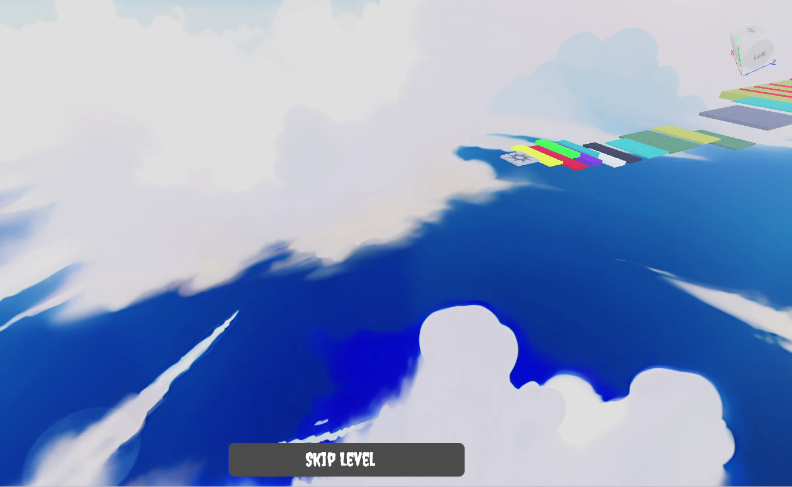

# Roblox Demo — Obby

A small Roblox obstacle course (obby) built in Roblox Studio: colored platforms, moving platforms, kill bricks, checkpoints that remember your level, and a **Skip Level** button sold as a Developer Product.



## What's in this repo

```
place/Roblox Demo.rbxl      The full game — open this in Roblox Studio
src/                        Every script in the game, as plain .luau files
  ServerScriptService/
    leaderstats.server.luau         Creates leaderstats.Level for each player
    SpawnScript.server.luau         Respawns a player at their checkpoint
    Skiplevel.server.luau           Handles the Skip Level purchase
  StarterGui/ScreenGui/Frame/TextButton/
    SkipLevelButton.client.luau     Opens the Skip Level purchase prompt
  Workspace/
    Checkpoints/Checkpoint.server.luau          Used by Checkpoint-1 … Checkpoint-4
    Level 3 - parts/KillPart.server.luau        Used by 10 kill bricks
    Level 3 - parts/SpinningKillPart.server.luau  Spinning kill brick
    MovingPlatforms/MovingPlatformZ.server.luau Platform sliding back and forth (Z)
    MovingPlatforms/MovingPlatformY.server.luau Platform moving up and down (Y)
tools/                      Script that re-exports src/ from the .rbxl
```

The `src/` folders follow the Studio Explorer. Scripts inside `Workspace` live inside parts, and several parts share one script, so each shared script is stored once. `MovingPlatforms/` has no folder in the game: those two scripts sit in the two parts named `Part` directly under `Workspace`.

The `.server.luau` / `.client.luau` suffixes mark a `Script` or a `LocalScript`, following the [Rojo](https://rojo.space) naming convention.

## Running it

1. Open `place/Roblox Demo.rbxl` in Roblox Studio.
2. Press **Play** (F5).

The Skip Level button uses Developer Product ID `3714741432`. If you publish the game under your own account, create a Developer Product and put its ID in both `SkipLevelButton.client.luau` and `Skiplevel.server.luau`.

## Keeping `src/` in sync

The `.rbxl` file is the source of truth. After editing in Studio, save the place over `place/Roblox Demo.rbxl`, then run:

```
python -m pip install -r tools/requirements.txt
python tools/export_scripts.py "place/Roblox Demo.rbxl"
```

This rewrites `src/` from the place file. It stops with an error if copies of a shared script no longer match (for example, if you edited only one checkpoint's script).

## How the levels work

Each checkpoint part holds a NumberValue named `Level` (1–4). Touching a checkpoint sets your `leaderstats.Level` to that number, and when you respawn, `SpawnScript` puts you back on the checkpoint that matches it. Buying **Skip Level** (handled in `MarketplaceService.ProcessReceipt`) moves you to the next checkpoint. At the last checkpoint there is nothing to skip to, so the purchase is not granted and the Robux are not kept.

`Level 2 - parts` is an empty folder.
